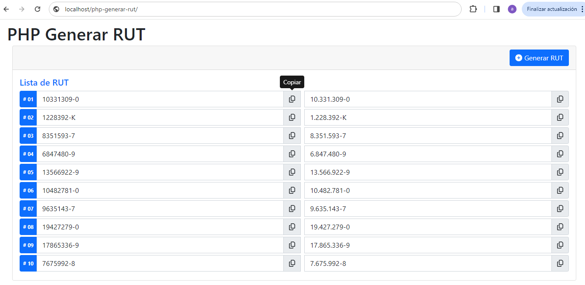

# php-generar-rut
PHP 7, PHP 8 que genera RUTs de Chile en forma aleatorea.

Para el cálculo de RUT en Chile, se utiliza el [Algoritmo del Módulo 11](https://es.wikipedia.org/wiki/C%C3%B3digo_de_control#M%C3%B3dulo_11)

La cantidad por defecto de RUT generados es 10.
Se pueden configurar la cantidad a generar en la siguiente opción:
```
const CANTIDADRUT = 10;
```


## Librerias
- [ ] jquery-3.7.1. [https://jquery.com/download/]
- [ ] Bootstrap 5.1 [https://getbootstrap.com/docs/5.1/getting-started/download/]
- [ ] sweetalert2 [https://sweetalert2.github.io/#download]
- [ ] Font Awesome Free 6.5.1 [https://fontawesome.com/download]
- [ ] Clipboard 2.0.11 [https://clipboardjs.com/]
- [ ] Popperjs 2.11.8 [https://cdn.jsdelivr.net/npm/@popperjs/core@2.11.8/dist/umd/popper.min.js]


## Clonar Repositorio
```
git clone https://github.com/compuvalpo/php-generar-rut.git
```


## Lavantar Repositorio en local
Una vez clonado el repositorio en su carpeta de Apache [www - htdocs - html - u otra según su versión] debe acceder a la siguiente url
`http://localhost/php-generar-rut`


## Capturas

